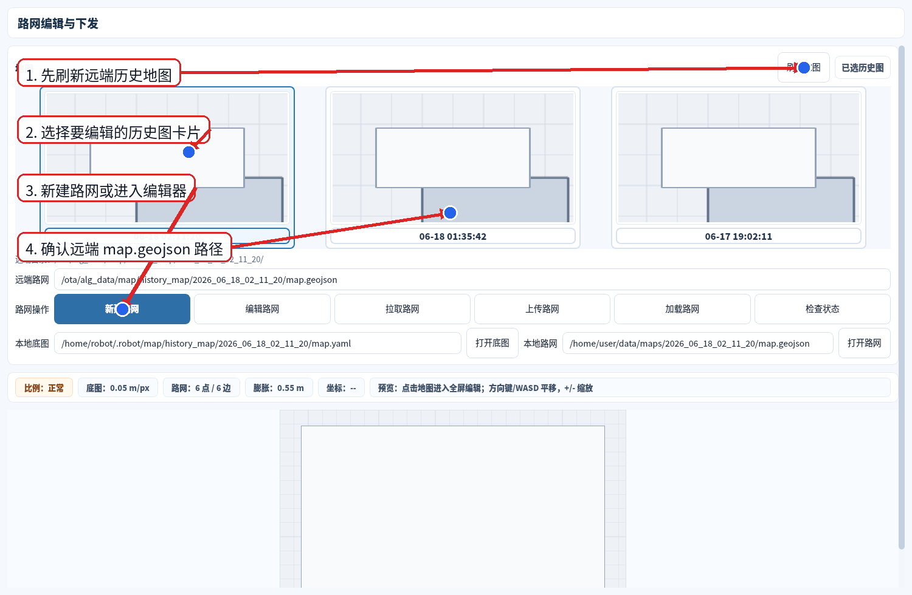
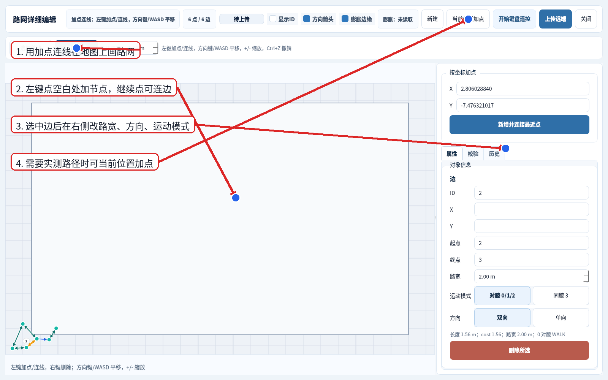
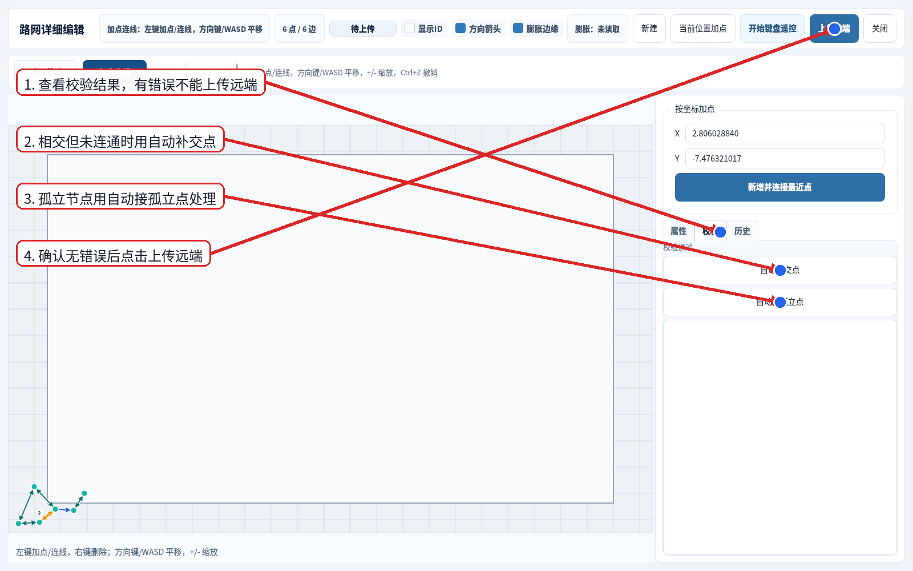
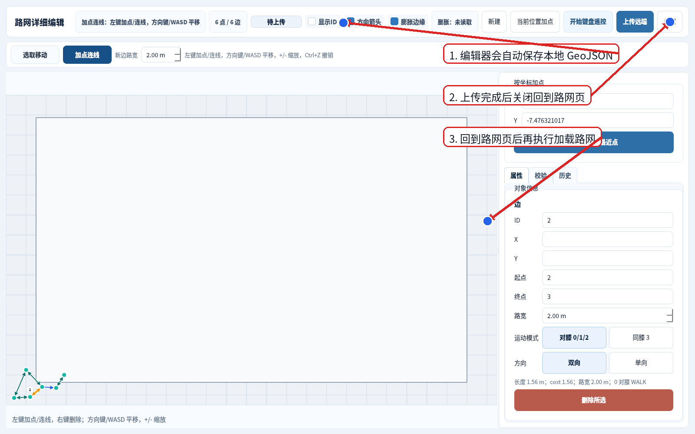
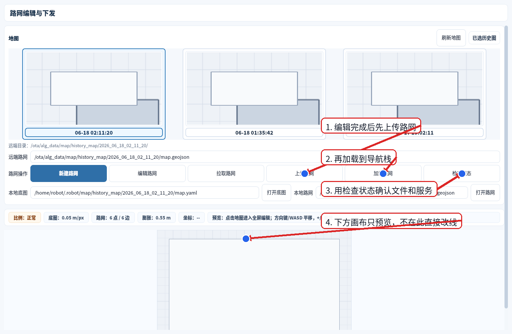

# Dog Remote Tool 路网编辑功能使用手册

适用场景：机器人已连接远端狗，已经有一张可用于导航的历史地图，需要为该地图创建或修改 `map.geojson` 路网，并下发给导航栈使用。

> 截图说明：当前系统限制真实运行窗口截图，本文截图使用当前 Dog Remote Tool 源码离屏渲染并加箭头标注；控件名称和操作顺序与工具一致，地图内容以现场实际历史图为准。

## 1. 操作前确认

- 当前设备已经连通，导航页能看到目标设备和历史地图。
- 已选择正确历史图。路网文件应与该历史图目录对应，例如 `history_map/<时间>/map.geojson`。
- 确认机器人处于安全状态；编辑路网本身不会让机器人运动，但“加载路网”和后续“开始路网导航”会影响导航行为。
- 不要把建图轨迹 `map.txt` 当作路网加载。路网下发文件必须是 `map.geojson`。

## 2. 进入路网编辑

在主界面进入“导航”页，刷新历史图并选择要编辑的地图，然后点击“编辑路网”。工具会打开对应历史图的路网编辑工作台。

操作顺序：

1. 点击“刷新地图”，读取远端历史地图列表。
2. 选择要编辑的历史图卡片。
3. 如果没有路网，点击“新建路网”；如果已有路网，点击“拉取路网”或“编辑路网”。
4. 检查“远端路网”路径，确认它指向当前历史图目录下的 `map.geojson`。

## 3. 编辑节点和连边

进入全屏编辑器后，默认使用“加点连线”。在地图空白处左键加节点，继续左键点击可把节点连成边；靠近已有节点点击时会复用已有节点。

常用操作：

- `加点连线`：左键加节点/连边。
- `选取移动`：选择节点或边；拖动节点会同步更新连边端点。
- 右键：删除命中的节点或边。
- `方向键/WASD`：平移视图。
- `+/-`：缩放视图。
- `Ctrl+Z`：撤销上一步。
- `当前位置加点`：定位正常时，把机器人当前位姿加入为节点，适合现场实测路径。

选中一条边后，在右侧“属性”里确认：

- `路宽`：写入 `passable_width`，影响路网可通行走廊宽度。
- `运动模式`：`对膝 0/1/2` 或 `同膝 3`。
- `方向`：`双向` 允许两端互通；`单向` 只允许从起点到终点通行。

## 4. 校验和修复

上传远端前必须看“校验”页。存在错误时不要上传；工具会把异常对象高亮，并在列表里显示原因。

处理方式：

1. 打开“校验”页查看错误/警告。
2. 如果两条边相交但没有共享节点，点击“自动补交点”。
3. 如果有孤立节点，点击“自动接孤立点”。
4. 修复后再次确认没有错误，再点击“上传远端”。

## 5. 上传并加载到导航栈

编辑器会自动保存本地 `map.geojson`。点击“上传远端”后，工具会把本地路网上传到当前历史图目录。上传成功后关闭编辑器，回到路网页执行“加载路网”。

回到路网页后按以下顺序操作：

1. 点击“上传路网”或确认编辑器内“上传远端”已完成。
2. 点击“加载路网”，调用 `/RouteGraphPlanner/update_graph` 更新导航栈路网。
3. 点击“检查状态”，确认远端 `map.geojson` 存在，且更新服务可用。
4. 回到“导航”页，进入路网导航模式后再选择路网目标并开始导航。

## 6. 常见问题

- 没有历史图：先在“导航”页点击“刷新历史图”，确认建图保存目录里有 `map.pgm/map.yaml`。
- 编辑器提示未加载底图：当前历史图本地预览还没拉取完成，等待同步完成后再打开编辑器。
- 上传按钮不可用：当前没有绑定远端历史图，只是在编辑本地地图；需要先选择远端历史图。
- 校验有错误：不要强行上传。先用“自动补交点”“自动接孤立点”修复，再检查节点和边属性。
- 加载路网失败：检查远端路径是否是 `map.geojson`，导航栈是否运行，`/RouteGraphPlanner/update_graph` 服务是否存在。
- 路网导航走不动：先分开检查地图加载、定位状态、路网是否已加载、目标节点是否连通，再看 `/navigation_state` 和速度链路。
